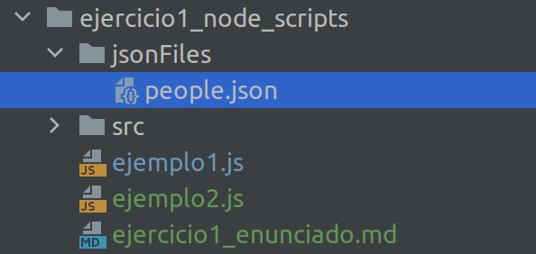
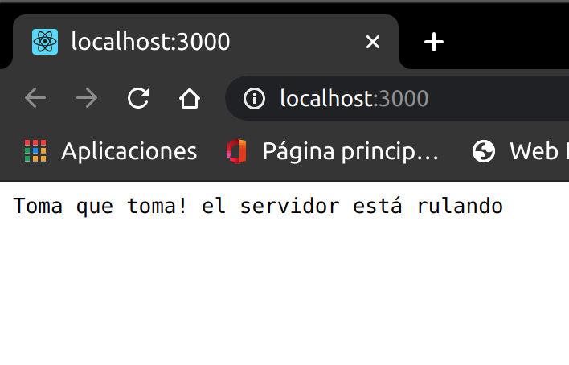

## Ejemplo1 - Probando funcionalidades de node.js

1. Crear una carpeta de trabajo (en mi caso ejercicio1_node_scripts)
2. Crear archivo **ejemplo1_helloWorld.js**
    * ```jsx
      console.log('Hello World')
      ```
      
    * escribir en el terminal 'node ejemplo1_helloWorld.js'
    
    * La consola debería mostrar:
    
    
  Esto significa que estamos lanzando scripts directamente en nuestro S.O. que antes de nodejs solo se podían ejecutar a través del navegador.
    
 NodeJS en un S.O. abre posibilidades como escribir archivos o abrir servidores.
    
    
## Ejemplo2 - fs.writeFile: Script para escribir archivos 

1. Crear archivo 'ejemplo2_crearArchivo.js' 
2. Crearemos una funcón usando el paquete 'fs' de node, el la que dado un array de objetos escriba un archivo .json :
    ```jsx
   const fs = require('fs');
   
   //Array de objetos que representan personas
   const people = [
       {
           firstName:'Ángel',
           lasName: 'Garrido'
       },
       {
           FirstName: 'Diana',
           lastName: 'Ripalda'
       },
       {
           firstName: 'Mabel',
           lastName: 'Álvarez'
       }
   ];
   
   // Transformamos el array a un JSON en formato String
   const data = JSON.stringify(people);
   
   // Creamos el archivo people.json y hacemos un console.log para que nos avise cuando se complete la escritura
   
   fs.writeFile('jsonFiles/people.json', data, () => {
       console.log('File created!');
   })
      
   ```
3. ejecutamos en el terminal 'node ejemplo2_crearArchivo.js'


Vemos como se ha creado el archivo en la ruta especificada



Gracias a esta herramienta podemos crear archivos de forma automática, esto abre muchas posibilidades en combinación con el uso de APIs externas.


## Ejemplo3 - Crear un servidor HTTP: http.createserver() y requestHandler

Existen  paquetes preparados para abrir servidores:
* http
* https (es para crear sevidores seguros, necesita usar certificados y firmas seguros para funcionar)

1. Crear archivo ejemplo3_servodor.js
2. Añadir el siguiente código:
```jsx
const http = require('http');

//Se encarga de escuchar las peticiones que lleguen al servidor.
const requestHandler = (req, res) => {
    //Si hacemos un console.log de req y res veremos que por consola sale un output muy largo
    console.log(req);
    console.log(res);
    //Indicamos que vamos a responder con un contenido de tipo json
    res.setHeader("Content-Type", "application/json");
    //Indicamos que la respuesta será el status 200 (éxito)
    res.writeHead(200);
    //Enviamos la respuesta a nuestros usarios
    res.end('Toma que toma! el servidor está rulando')

};


const PORT = 3000;
const server = http.createServer(requestHandler);


// El servidor necesita dos argumentos, el puerto y un callback para que funcione con node
server.listen(PORT, ()=>{
    console.log(`Server started in http://localhost:${PORT}`);
})

```   
 
* Req &rarr; **request**

    * Contenido que llega desde el navegador al servidor
    * Contiene info sobre cookies, sesión, url y los headers que identifican una petición http.
    * "***Me dice qué nos están pidiendo al servidor, y si esta petición la están haciendo como usuario registrado o no.***" Yo Mismo Garrido Álvarez
  

* Res &rarr; **response**
    * indica la forma en la que queremos envíar la información de vuelta al navegador

* Los HTTP headers son la parte central de los HTTP requests y responses, y transmiten información acerca del navegador del cliente, de la página solicitada, del servidor, etc.


Si marcamos en el terminal node ejemplo3_servidor.js y ponemos en nuestro navagador http://localhost:3000/ veremos el mesaje que se está lanzando desde el servidor que hemos creado:

;

Ya tenemos un servidor que responde a nuestras peticiones abierto en node.js 💃

## Ejemplo4 - fs.readFile: Leer archivos utilizando Node.js

* Crear archivo ejemplo4.js
```jsx
const fs = require('fs');
// Leemos un archivo en la dirección dada y el callback es invocado cuando se termina de leer y procesar el archivo

fs.readFile('jsonFiles/people.json', (err, data)=>{
    if (err) {
        //Si recibimos un error en el callback, lo mostraremos en la consola
        console.log('WTF! there was an error reading the file! ¬_¬');
    }else{
        //Si obtenemos los datos y no un error, habtá wur transformar la información con JSON.parse() para mostrarla
        const parseData = JSON.parse(data);
        console.log(parseData);
    }
});
```
* node ejemplo4_leerArchivo.js 

El código anterior fue modificado poniendo una ruta incorrecta para ver que sucedía en al consola al detectar un error, a continuación se puede ver la captura de pantalla de la consola con error y sin error:


## Ejemplo5 - utilizar endpoints en el servidor con req.url

```jsx
const http = require('http');

const requestHandler = (req, res) => {
    if(req.url === '/hello') {
        res.setHeader('Content-Type','application/json');
        res.writeHead(200);
        res.end('Hello World from the route "/hello"');
    }

    else if(req.url === '/byebye') {
        res.setHeader('Content-Type', 'application/json');
        res.writeHead(200);
        res.end('Bye from the route "/byebye"');
    }

    else{
        res.end(`Try to use localhost:${PORT}/hello in the navbar`)
    }
};

const PORT = 3000;
const server = http.createServer(requestHandler);

server.listen(PORT, () => {
    console.log(`Hello!!! Server started in http//localhost:${PORT}`);
});
```


Ya podemos usar endpoints con node.js!
