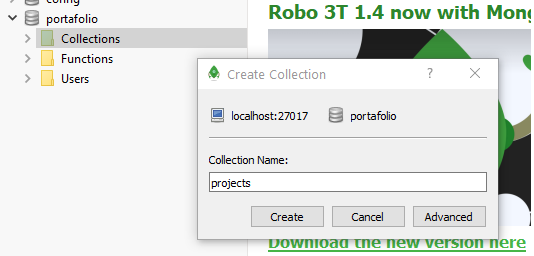

# nodeJS

Este repositorio está compuesto por resúmenes teóricos y ejercicios prácticos que he utilizado para reforzar mis conocimientos de nodeJS.

Los contenidos están basados en los contenidos del Bootcamp de desarrollador web FullStack [Upgrade-Hub](https://pro.upgrade-hub.com/) y [Master en JavaScript: Aprender JS, jQuery, Angular, NodeJS](https://www.udemy.com/course/master-en-javascript-aprender-js-jquery-angular-nodejs-y-mas/) de Víctor Robles

Todo el contenido ha sido modificado para facilitar su comprensión, y en muchos casos la información se ha ampliado con otras fuentes como W3Schools, CodeCademy, Udemy o Wikipedia.


# INDICE

0. [Node.js: JavaScript en el servidor](#id0)
1. [Hello World](#id1)
2. [fs.writeFile: Script para escribir archivos](#id2) 
3. [Crear un servidor HTTP: http.createserver() y requestHandler](#id3) 
4. [fs.readFile: Leer archivos utilizando Node.js](#id4)
5. [Utilizar endpoints en el servidor con req.url](#id5)
6. [Capturar parámetros con process.argv.slice()](#id6)
7. [Creando un Backend - API REST](#id7)
    * Dependencias: express, body-parser, connect-multiparty, mongoose, nodemon
    * Conectar Mongo
    * Cliente RESTful
    * Crear modelos
    * Modelo Vista Controlador - MVC
8. [Crear una base de datos en Mongo](#id8)

## 0. Node.js: JavaScript en el servidor

* Node.js es un **entorno de ejecución para JavaScript construido con el motor JavaScript v8 de Chrome.**

* Hace funcionar código JavaScript directamente en el S.O. sin usar un navegador aplicando este mismo motor.

* Programadores Frontend de JavaScript ahora pueden programar en el mismo lenguaje en el Backend.

* [Instalar Node.js](https://nodejs.org/es/) 

## 1. Hello World<a name="id1"></a>
* [01_helloWorld.js](node_scripts/01_helloWorld.js)


1. Crear una carpeta de trabajo (en mi caso ejercicio1_node_scripts)
2. Crear archivo **01_helloWorld.js**
    * ```jsx
      console.log('Hello World')
      ```
      
    * escribir en el terminal 'node 01_helloWorld.js'
    
    * La consola debería mostrar:
    
    
  Esto significa que estamos lanzando scripts directamente en nuestro S.O. que antes de nodejs solo se podían ejecutar a través del navegador.
    
 NodeJS en un S.O. abre posibilidades como escribir archivos o abrir servidores.
    
    
## 2. fs.writeFile: Script para escribir archivos<a name="id2"></a>
* [02_crearArchivo.js](node_scripts/02_crearArchivo.js)

1. Crear archivo '02_crearArchivo.js' 
2. Crearemos una funcón usando el paquete 'fs' de node, el la que dado un array de objetos escriba un archivo .json :
    ```jsx
   const fs = require('fs');
   
   //Array de objetos que representan personas
   const people = [
       {
           firstName:'Ángel',
           lasName: 'Garrido'
       },
       {
           FirstName: 'Diana',
           lastName: 'Ripalda'
       },
       {
           firstName: 'Mabel',
           lastName: 'Álvarez'
       }
   ];
   
   // Transformamos el array a un JSON en formato String
   const data = JSON.stringify(people);
   
   // Creamos el archivo people.json y hacemos un console.log para que nos avise cuando se complete la escritura
   
   fs.writeFile('jsonFiles/people.json', data, () => {
       console.log('File created!');
   })
      
   ```
3. ejecutamos en el terminal 'node 02_crearArchivo.js'


Vemos como se ha creado el archivo en la ruta especificada


Gracias a esta herramienta podemos crear archivos de forma automática, esto abre muchas posibilidades en combinación con el uso de APIs externas.


## 3. Crear un servidor HTTP: http.createserver() y requestHandler<a name="id3"></a>
* [03_servidor.js](node_scripts/03_servidor.js)

Existen  paquetes preparados para abrir servidores:
* http
* https (es para crear sevidores seguros, necesita usar certificados y firmas seguros para funcionar)

1. Crear archivo ejemplo3_servodor.js
2. Añadir el siguiente código:
```jsx
const http = require('http');

//Se encarga de escuchar las peticiones que lleguen al servidor.
const requestHandler = (req, res) => {
    //Si hacemos un console.log de req y res veremos que por consola sale un output muy largo
    console.log(req);
    console.log(res);
    //Indicamos que vamos a responder con un contenido de tipo json
    res.setHeader("Content-Type", "application/json");
    //Indicamos que la respuesta será el status 200 (éxito)
    res.writeHead(200);
    //Enviamos la respuesta a nuestros usarios
    res.end('Toma que toma! el servidor está rulando')

};


const PORT = 3000;
const server = http.createServer(requestHandler);


// El servidor necesita dos argumentos, el puerto y un callback para que funcione con node
server.listen(PORT, ()=>{
    console.log(`Server started in http://localhost:${PORT}`);
})

```   
 
* Req &rarr; **request**

    * Contenido que llega desde el navegador al servidor
    * Contiene info sobre cookies, sesión, url y los headers que identifican una petición http.
    * "***Me dice qué nos están pidiendo al servidor, y si esta petición la están haciendo como usuario registrado o no.***" Yo Mismo Garrido Álvarez
  

* Res &rarr; **response**
    * indica la forma en la que queremos envíar la información de vuelta al navegador

* Los HTTP headers son la parte central de los HTTP requests y responses, y transmiten información acerca del navegador del cliente, de la página solicitada, del servidor, etc.


Si marcamos en el terminal node 03_servidor.js y ponemos en nuestro navagador http://localhost:3000/ veremos el mesaje que se está lanzando desde el servidor que hemos creado:

;

Ya tenemos un servidor que responde a nuestras peticiones abierto en node.js 💃

## 4. fs.readFile: Leer archivos utilizando Node.js<a name="id4"></a>
* [04_leerArchivo.js](node_scripts/04_leerArchivo.js)

* Crear archivo ejemplo4.js
```jsx
const fs = require('fs');
// Leemos un archivo en la dirección dada y el callback es invocado cuando se termina de leer y procesar el archivo

fs.readFile('jsonFiles/people.json', (err, data)=>{
    if (err) {
        //Si recibimos un error en el callback, lo mostraremos en la consola
        console.log('WTF! there was an error reading the file! ¬_¬');
    }else{
        //Si obtenemos los datos y no un error, habtá que transformar la información con JSON.parse() para mostrarla
        const parseData = JSON.parse(data);
        console.log(parseData);
    }
});
```
* node 04_leerArchivo.js 

El código anterior fue modificado poniendo una ruta incorrecta para ver que sucedía en la consola al detectar un error, a continuación se puede ver la captura de pantalla de la consola con error y sin error:


## 5. Utilizar endpoints en el servidor con req.url<a name="id5"></a>
* [05_endpoints.js](node_scripts/05_endpoints.js)

```jsx
const http = require('http');

const requestHandler = (req, res) => {
    if(req.url === '/hello') {
        res.setHeader('Content-Type','application/json');
        res.writeHead(200);
        res.end('Hello World from the route "/hello"');
    }

    else if(req.url === '/byebye') {
        res.setHeader('Content-Type', 'application/json');
        res.writeHead(200);
        res.end('Bye from the route "/byebye"');
    }

    else{
        res.end(`Try to use localhost:${PORT}/hello in the navbar`)
    }
};

const PORT = 3000;
const server = http.createServer(requestHandler);

server.listen(PORT, () => {
    console.log(`Hello!!! Server started in http//localhost:${PORT}`);
});
```


Ya podemos usar endpoints con node.js!

## 6. Capturar parámetros con process.argv.slice()<a name="id6"></a>
* [06_captura_parametros.js](node_scripts/06_captura_parametros.js)

* Podemos pasar  parámetros por nuestro terminal para luego poder operar con ellos
```shell script
node .\06_captura_parametros.js 22 "hello" true flofi 123
```
* He pasado una lista de parámetros aleatorios para ver como almacena y como se muestran los datos

```js
'use strict'
var params = process.argv.slice(2) //ponemos el 2 para que no me devuelva la ruta del archivo
var params0 = process.argv.slice(1) //vemos que si ponemos 1 me devuelve la ruta del archivo


console.log(params); //[ '22', 'hello', 'true', 'flofi', '123' ]
console.log(params0);
/*
[
  'C:\\Users\\angel\\GitHub\\nodeJS\\node_scripts\\06_captura_parametros.js',
  '22',
  'hello',
  'true',
  'flofi',
  '123'
]
 */
```
A continuación voy a realizar operaciones de calculadora con los valores 0 y 4 que he introducido por el terminal (que son los dos a los que les he puesto un número de valor)

```js
let valor1 = parseFloat(params[0]); //pasamos a formato número decimal el parámetro 0
let valor2 = parseFloat(params[4]);

console.log(`${valor1} + ${valor2} = ${valor1 + valor2}`);
console.log(`${valor1} - ${valor2} = ${valor1 - valor2}`);
console.log(`${valor1} x ${valor2} = ${valor1 * valor2}`);
console.log(`${valor1} / ${valor2} = ${valor1 / valor2}`);
/*
22 + 123 = 145
22 - 123 = -101
22 x 123 = 2706
22 / 123 = 0.17886178861788618
 */
```
## 7. Creando un Backend - API REST <a name="id7"></a>
[backend](backend)
**Resumen general** de comandos para instalar npm y varias dependencias utiles:
```shell script
npm init
npm install express --save
npm install body-parser --save
npm install connect-multiparty --save
npm install mongoose --save
npm install nodemon --save-dev
```

### 7.1. **API REST**
* Programa o servicio que está en el backend
* nos permite recibir peticiones http por los diferentes métodos que acepta el protocolo http:
    * POST
    * GET
    * PUT
    * DELETE
* Estas peticiones interactúan con la BBDD y nos devuelve un resultado en formato json.

### 7.2. Pasos para crear nuestra API REST

* Me voy a mi carpeta del proyecto (en este caso creo la carpeta backend) desde el terminal y ejecuto el comando:
```shell script
npm init
```
* Esto me genera el archivo package.json que contiene:
    * configuración del proyecto
    * dependencias
* Me pide una serie de campos, el más importante es el entry point
    * hay que poner que archivo va a ser el inicial
    * en mi caso index.js
    
### 7.3. Instalar dependencias
* Dependencias necesarias para que funcione el proyecto
* NodeJS es una plataforma
    * Para que funcione como si un framework y añadir funcionalidades como conectarse a MongoDB hay que instalar dependencias:
        * Ej: express, body-parser...
        
#### Express - definir rutas y manejar peticiones
* Framework para trabajar con el protocolo http:
    * definir rutas, manejar peticiones, métodos, etc...
```shell script
npm install express --save
```
#### Body-parser - convertir mis peticiones a JSON
* Convierte las peticiones que yo hago al backend a formato json para poder utilizarlo con javascript
```shell script
npm install body-parser --save
```

#### Connect-multiparty - subir archivos a mi backend
* Permite subir archivos a mi backend
* Trabajar con el protocolo files
```shell script
npm install connect-multiparty --save
```

#### Mongoose
* ORM para trabajar con mongo db
* Tiene métodos que facilitan el trabajo con Mongo db
* Permite crear modelos, entidades, ...
```shell script
npm install mongoose --save
```

#### Nodemon
* Cada vez que haga un cambio en el código, automáticamente va a refrescar y va a mostrarme los datos actualizados
* Sirve para trabajar en local y ver como se van implmentando los cambios sin tener que parar y reinicializar node
```shell script
npm install nodemon --save-dev
```

Tenemos que actualizar nuestro package.json y añadir dentro de scripts la siguiente linea para que cada vez que haga npm start se lance también nodemon.
```json
//...
  "scripts": {
    //...
    "start": "nodemon index.js"
  },
//...
```

## 8. Crear una base de datos en Mongo <a name="id8"></a>

* Tenemos que tener abierto el "daemon" de mongo:
    * Programa\MongoDB\Server\4.4\Bin\mongod.exe
* Abrir Robo3T, y con nuestra configuración ya creada, elegimos la BBDD a la que nos vamos a conectar (en nuestro caso MongoDB-Local) y pulsamos 'Connect'.
* Pulsar sobre nuestra BBDD (MongoDB-Local) y elegir 'create database' (en nuestro caso la llamamos portafolio)


### Crear colecciones y documentos

* Dentro de nuestra BBDD (portafolio) pulsar botón derecho sobre collection --> create collection: dar nombre (projects en nuestro caso)



* Creo documentos con el botón derecho pulsando sobre la colección
* Introduzco los datos en formato JSON


Ya puedo hacer consultas y visualizarlas en formato gráfico o en JSON si pulso sobre el icono correspondiente en la parte superior derecha de la ventana.
