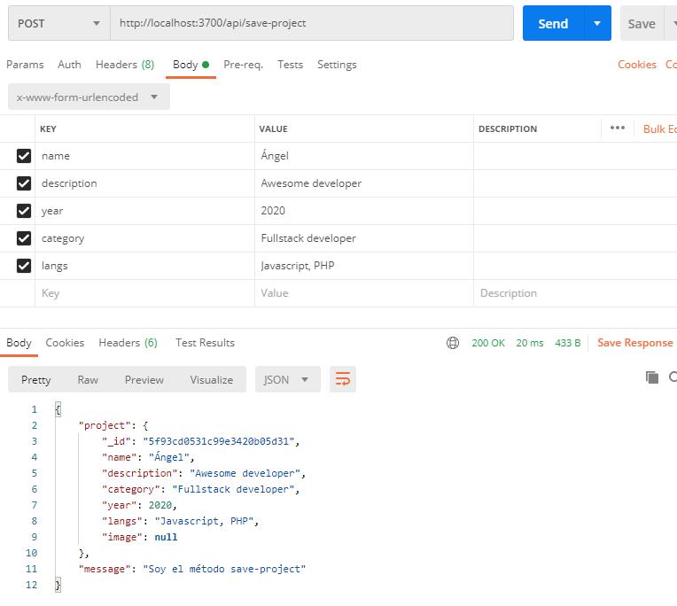
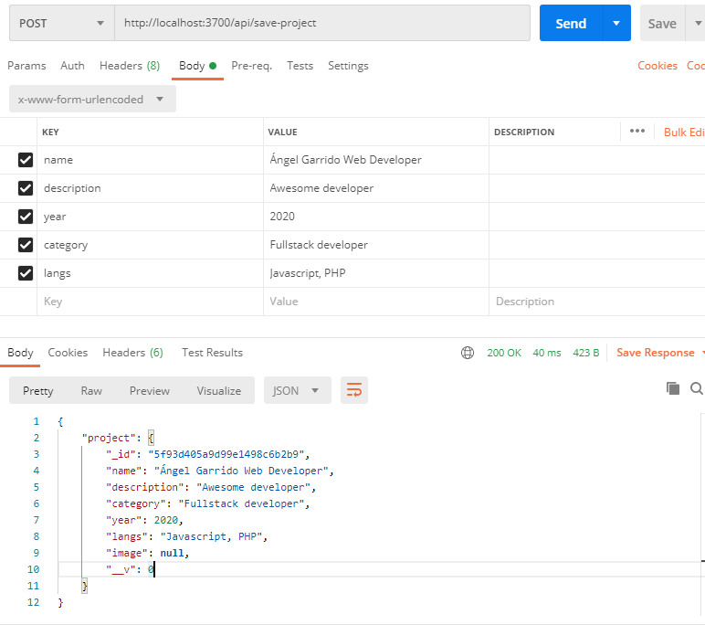

# NodeJS

Este repositorio está compuesto por resúmenes teóricos y ejercicios prácticos que he utilizado para reforzar mis conocimientos de nodeJS.

Los contenidos están basados en los contenidos del Bootcamp de desarrollador web FullStack [Upgrade-Hub](https://pro.upgrade-hub.com/) y [Master en JavaScript: Aprender JS, jQuery, Angular, NodeJS](https://www.udemy.com/course/master-en-javascript-aprender-js-jquery-angular-nodejs-y-mas/) de Víctor Robles

Todo el contenido ha sido modificado para facilitar su comprensión, y en muchos casos la información se ha ampliado con otras fuentes como W3Schools, CodeCademy, Udemy o Wikipedia.


# INDICE

0. [Node.js: JavaScript en el servidor](#id0)
1. [Hello World](#id1)
2. [fs.writeFile: Script para escribir archivos](#id2) 
3. [Crear un servidor HTTP: http.createserver() y requestHandler](#id3) 
4. [fs.readFile: Leer archivos utilizando Node.js](#id4)
5. [Utilizar endpoints en el servidor con req.url](#id5)
6. [Capturar parámetros con process.argv.slice()](#id6)
7. [Creando un Backend - API REST](#id7)
    * 7.1 [Instalar dependencias](#id7.1)
    * 7.2 [Crear una base de datos en Mongo](#id7.2)
    * 7.3 [Conectar NodeJs con MongoDB](#id7.3)
    * 7.4 [Crear servidor con NodeJS - Express](#id7.4)
    * 7.5 [Postman: Usar un cliente RESTful](#id7.5)
    * 7.6 [Crear modelos](#7.6)
    * 7.7 [MVC - Modelo Vista Controlador](#id7.7)
    
8. [El controlador del backend de Node](#id8)
    * [8.1 Controladores y Rutas en Node](#id8.1)
    * [8.2 Método para guardar nuevos documentos en la BBDD](#id8.2)
    * [8.3 Listar Proyectos del Portafolio](#id8.3)
    * [8.4 Devolver listado de proyectos](#id8.4)
    * [8.5 Actualizar Datos](#id8.5)
    * [8.6 Borrar Proyectos](#id8.6)

9. [Subir archivos en NodeJS](#id9)
    * [9.1 Subir imágenes](#id9.1)
    * [9.2 Mejoras en la subida de archivos](#id9.2)
    * [9.3 Configurar cabeceras HTTP y acceso CORS en NodeJS](#id9.3)

## 0. Node.js: JavaScript en el servidor

* Node.js es un **entorno de ejecución para JavaScript construido con el motor JavaScript v8 de Chrome.**

* Hace funcionar código JavaScript directamente en el S.O. sin usar un navegador aplicando este mismo motor.

* Programadores Frontend de JavaScript ahora pueden programar en el mismo lenguaje en el Backend.

* [Instalar Node.js](https://nodejs.org/es/) 

## 1. Hello World<a name="id1"></a>
* [01_helloWorld.js](node_scripts/01_helloWorld.js)


1. Crear una carpeta de trabajo (en mi caso ejercicio1_node_scripts)
2. Crear archivo **01_helloWorld.js**
    * ```jsx
      console.log('Hello World')
      ```
      
    * escribir en el terminal 'node 01_helloWorld.js'
    
    * La consola debería mostrar:
    
    
  Esto significa que estamos lanzando scripts directamente en nuestro S.O. que antes de nodejs solo se podían ejecutar a través del navegador.
    
 NodeJS en un S.O. abre posibilidades como escribir archivos o abrir servidores.
    
    
## 2. fs.writeFile: Script para escribir archivos<a name="id2"></a>
* [02_crearArchivo.js](node_scripts/02_crearArchivo.js)

1. Crear archivo '02_crearArchivo.js' 
2. Crearemos una funcón usando el paquete 'fs' de node, el la que dado un array de objetos escriba un archivo .json :
    ```jsx
   const fs = require('fs');
   
   //Array de objetos que representan personas
   const people = [
       {
           firstName:'Ángel',
           lasName: 'Garrido'
       },
       {
           FirstName: 'Diana',
           lastName: 'Ripalda'
       },
       {
           firstName: 'Mabel',
           lastName: 'Álvarez'
       }
   ];
   
   // Transformamos el array a un JSON en formato String
   const data = JSON.stringify(people);
   
   // Creamos el archivo people.json y hacemos un console.log para que nos avise cuando se complete la escritura
   
   fs.writeFile('jsonFiles/people.json', data, () => {
       console.log('File created!');
   })
      
   ```
3. ejecutamos en el terminal 'node 02_crearArchivo.js'


Vemos como se ha creado el archivo en la ruta especificada


Gracias a esta herramienta podemos crear archivos de forma automática, esto abre muchas posibilidades en combinación con el uso de APIs externas.


## 3. Crear un servidor HTTP: http.createserver() y requestHandler<a name="id3"></a>
* [03_servidor.js](node_scripts/03_servidor.js)

Existen  paquetes preparados para abrir servidores:
* http
* https (es para crear sevidores seguros, necesita usar certificados y firmas seguros para funcionar)

1. Crear archivo ejemplo3_servodor.js
2. Añadir el siguiente código:
```jsx
const http = require('http');

//Se encarga de escuchar las peticiones que lleguen al servidor.
const requestHandler = (req, res) => {
    //Si hacemos un console.log de req y res veremos que por consola sale un output muy largo
    console.log(req);
    console.log(res);
    //Indicamos que vamos a responder con un contenido de tipo json
    res.setHeader("Content-Type", "application/json");
    //Indicamos que la respuesta será el status 200 (éxito)
    res.writeHead(200);
    //Enviamos la respuesta a nuestros usarios
    res.end('Toma que toma! el servidor está rulando')

};


const PORT = 3000;
const server = http.createServer(requestHandler);


// El servidor necesita dos argumentos, el puerto y un callback para que funcione con node
server.listen(PORT, ()=>{
    console.log(`Server started in http://localhost:${PORT}`);
})

```   
 
* Req &rarr; **request**

    * Contenido que llega desde el navegador al servidor
    * Contiene info sobre cookies, sesión, url y los headers que identifican una petición http.
    * "***Me dice qué nos están pidiendo al servidor, y si esta petición la están haciendo como usuario registrado o no.***" Yo Mismo Garrido Álvarez
  

* Res &rarr; **response**
    * indica la forma en la que queremos envíar la información de vuelta al navegador

* Los HTTP headers son la parte central de los HTTP requests y responses, y transmiten información acerca del navegador del cliente, de la página solicitada, del servidor, etc.


Si marcamos en el terminal node 03_servidor.js y ponemos en nuestro navagador http://localhost:3000/ veremos el mesaje que se está lanzando desde el servidor que hemos creado:

;

Ya tenemos un servidor que responde a nuestras peticiones abierto en node.js 💃

## 4. fs.readFile: Leer archivos utilizando Node.js<a name="id4"></a>
* [04_leerArchivo.js](node_scripts/04_leerArchivo.js)

* Crear archivo ejemplo4.js
```jsx
const fs = require('fs');
// Leemos un archivo en la dirección dada y el callback es invocado cuando se termina de leer y procesar el archivo

fs.readFile('jsonFiles/people.json', (err, data)=>{
    if (err) {
        //Si recibimos un error en el callback, lo mostraremos en la consola
        console.log('WTF! there was an error reading the file! ¬_¬');
    }else{
        //Si obtenemos los datos y no un error, habtá que transformar la información con JSON.parse() para mostrarla
        const parseData = JSON.parse(data);
        console.log(parseData);
    }
});
```
* node 04_leerArchivo.js 

El código anterior fue modificado poniendo una ruta incorrecta para ver que sucedía en la consola al detectar un error, a continuación se puede ver la captura de pantalla de la consola con error y sin error:


## 5. Utilizar endpoints en el servidor con req.url<a name="id5"></a>
* [05_endpoints.js](node_scripts/05_endpoints.js)

```jsx
const http = require('http');

const requestHandler = (req, res) => {
    if(req.url === '/hello') {
        res.setHeader('Content-Type','application/json');
        res.writeHead(200);
        res.end('Hello World from the route "/hello"');
    }

    else if(req.url === '/byebye') {
        res.setHeader('Content-Type', 'application/json');
        res.writeHead(200);
        res.end('Bye from the route "/byebye"');
    }

    else{
        res.end(`Try to use localhost:${PORT}/hello in the navbar`)
    }
};

const PORT = 3000;
const server = http.createServer(requestHandler);

server.listen(PORT, () => {
    console.log(`Hello!!! Server started in http//localhost:${PORT}`);
});
```


Ya podemos usar endpoints con node.js!

## 6. Capturar parámetros con process.argv.slice()<a name="id6"></a>
* [06_captura_parametros.js](node_scripts/06_captura_parametros.js)

* Podemos pasar  parámetros por nuestro terminal para luego poder operar con ellos
```shell script
node .\06_captura_parametros.js 22 "hello" true flofi 123
```
* He pasado una lista de parámetros aleatorios para ver como almacena y como se muestran los datos

```js
'use strict'
var params = process.argv.slice(2) //ponemos el 2 para que no me devuelva la ruta del archivo
var params0 = process.argv.slice(1) //vemos que si ponemos 1 me devuelve la ruta del archivo


console.log(params); //[ '22', 'hello', 'true', 'flofi', '123' ]
console.log(params0);
/*
[
  'C:\\Users\\angel\\GitHub\\nodeJS\\node_scripts\\06_captura_parametros.js',
  '22',
  'hello',
  'true',
  'flofi',
  '123'
]
 */
```
A continuación voy a realizar operaciones de calculadora con los valores 0 y 4 que he introducido por el terminal (que son los dos a los que les he puesto un número de valor)

```js
let valor1 = parseFloat(params[0]); //pasamos a formato número decimal el parámetro 0
let valor2 = parseFloat(params[4]);

console.log(`${valor1} + ${valor2} = ${valor1 + valor2}`);
console.log(`${valor1} - ${valor2} = ${valor1 - valor2}`);
console.log(`${valor1} x ${valor2} = ${valor1 * valor2}`);
console.log(`${valor1} / ${valor2} = ${valor1 / valor2}`);
/*
22 + 123 = 145
22 - 123 = -101
22 x 123 = 2706
22 / 123 = 0.17886178861788618
 */
```
## 7. Creando un Backend - API REST <a name="id7"></a>
[backend](backend)
**Resumen general** de comandos para instalar npm y varias dependencias utiles:
```shell script
npm init
npm install express --save
npm install body-parser --save
npm install connect-multiparty --save
npm install mongoose --save
npm install nodemon --save-dev
```

#### Definición **API REST**
* Programa o servicio que está en el backend
* nos permite recibir peticiones http por los diferentes métodos que acepta el protocolo http:
    * POST
    * GET
    * PUT
    * DELETE
* Estas peticiones interactúan con la BBDD y nos devuelve un resultado en formato json.

#### Primeros Pasos para crear nuestra API REST

* Me voy a mi carpeta del proyecto (en este caso creo la carpeta backend) desde el terminal y ejecuto el comando:
```shell script
npm init
```
* Esto me genera el archivo package.json que contiene:
    * configuración del proyecto
    * dependencias
* Me pide una serie de campos, el más importante es el entry point
    * hay que poner que archivo va a ser el inicial
    * en mi caso index.js
    
### 7.1. Instalar dependencias  <a name="id7.2"></a>
* Dependencias necesarias para que funcione el proyecto
* NodeJS es una plataforma
    * Para que funcione como si un framework y añadir funcionalidades como conectarse a MongoDB hay que instalar dependencias:
        * Ej: express, body-parser...
        
#### Express - definir rutas y manejar peticiones
* Framework para trabajar con el protocolo http:
    * definir rutas, manejar peticiones, métodos, etc...
```shell script
npm install express --save
```
#### Body-parser - convertir mis peticiones a JSON
* Convierte las peticiones que yo hago al backend a formato json para poder utilizarlo con javascript
```shell script
npm install body-parser --save
```

#### Connect-multiparty - subir archivos a mi backend
* Permite subir archivos a mi backend
* Trabajar con el protocolo files
```shell script
npm install connect-multiparty --save
```

#### Mongoose
* ORM para trabajar con mongo db
* Tiene métodos que facilitan el trabajo con Mongo db
* Permite crear modelos, entidades, ...
```shell script
npm install mongoose --save
```

#### Nodemon
* Cada vez que haga un cambio en el código, automáticamente va a refrescar y va a mostrarme los datos actualizados
* Sirve para trabajar en local y ver como se van implmentando los cambios sin tener que parar y reinicializar node
```shell script
npm install nodemon --save-dev
```

Tenemos que actualizar nuestro package.json y añadir dentro de scripts la siguiente linea para que cada vez que haga npm start se lance también nodemon.
```json
//...
  "scripts": {
    //...
    "start": "nodemon index.js"
  },
//...
```

### 7.2. Crear una base de datos en Mongo <a name="id7.2"></a>

* Previamente tenemos que tener instalado [MongoDB](https://github.com/AngelGarridoAlvarez/Mongo#id2)
* Tenemos que tener abierto el "daemon" de mongo:
    * Programa\MongoDB\Server\4.4\Bin\mongod.exe
* Abrir Robo3T, y con nuestra configuración ya creada, elegimos la BBDD a la que nos vamos a conectar (en nuestro caso MongoDB-Local) y pulsamos 'Connect'.
* Pulsar sobre nuestra BBDD (MongoDB-Local) y elegir 'create database' (en nuestro caso la llamamos portafolio)


### Crear colecciones y documentos

* Dentro de nuestra BBDD (portafolio) pulsar botón derecho sobre collection --> create collection: dar nombre (projects en nuestro caso)


* Creo documentos con el botón derecho pulsando sobre la colección
* Introduzco los datos en formato JSON


Ya puedo hacer consultas y visualizarlas en formato gráfico o en JSON si pulso sobre el icono correspondiente en la parte superior derecha de la ventana.


### 7.3. Conectar NodeJs con MongoDB<a name="id7.3"></a>

**backend/index.js**
```js
'use strict'

let mongoose = require('mongoose');
//cargo el módulo mongoose
//Ya tengo un objeto en la variable mongoose

//Realizamos la conexión a la base de datos mediante una promesa

mongoose.Promise = global.Promise;
mongoose.connect('mongodb://localhost:27017/portafolio')
// el local host es el predefinido de mongo que nosotros hemos seteado cuando hemos creado la BBDD
    .then(()=>{
        console.log('Conexión a la BBDD de Mongo establecida con éxito')
    })
    .catch(err => console.log(err));//Para capturar el error
```
Terminal --> Carpeta Backend:
* npm start
* Se ejecuta el script start que va a hacer un nodemon con el index.js
* Comprobamos si mi node.js se conecta con MongoDB

### 7.4 Crear servidor con NodeJS - Express <a name="id7.4"></a>
**Express** nos permite:
* Tener un sistema de rutas
* Realizar peticiones HTTP

creamos el archivo **backend/app.js** para configurar express:
```js
//En este archivo vamos a configurar Express
'use strict'

var express = require('express');//accede a la carpeta correspondiente de node_modules para usar esta librería
var bodyParser = require('body-parser');
var index = require("./index"); //Me importo index para poder usar directamente la variable puerto que he exportado en este archivo

var app = express();

//Archivos de Rutas - aquí vamos a importar archivos de rutas para poder utilizarlos en el apartado inferior RUTAS

//Middlewares:
// * métodos que se ejecutan antes de ejecutar la acción de un controlador/ el resultado de la petición
// * Primero se ejecuta el middleware, luego la funcionalidad principal de la ruta en la que estemos

app.use(bodyParser.urlencoded({extended: false}));//configuración necesaria para bodyParser
app.use(bodyParser.json());//Lo que me llegue hay que convertirlo a JSON

//CORS

//RUTAS

//Creo la ruta test para probar el funcionamiento mandando un JSON como mensaje
app.get('/test', (req,res) => {
    res.status(200).send({
        message: "Hello World from my NodeJS API"
    });
    //si recibo una res estatus 200 (exitosa) envío el mensaje
});

app.get('/', (req,res) => {
    res.status(200).send("<h1>Pagina de inicio, prueba la ruta localhost:"+ index.puerto + "/test</h1>")
   });

// exportar
module.exports = app;//exporto la variable app que tiene express y toda la configuración de los middleware
```

Para crear el servidor lo hago desde index.js
* Cargo la configuración de express que acabo de crear
* Creo la variable port para indicar el puerto del servidor
* Cuándo se conecte a la base de datos, creo el servidor e indico dentro del .then correspondiente
    * app.listen(port, callback)

**backend/index.js**
```js
'use strict'

let mongoose = require('mongoose');
var app = require('./app');
var port = 3700;
//cargo el módulo mongoose
//Ya tengo un objeto en la variable mongoose

//Realizamos la conexión a la base de datos mediante una promesa

mongoose.Promise = global.Promise;
mongoose.connect('mongodb://localhost:27017/portafolio')
// el local host es el predefinido de mongo que nosotros hemos seteado cuando hemos creado la BBDD
    .then(()=>{
        console.log('Conexión a la BBDD de Mongo establecida con éxito');

        //Creación del servidor
        app.listen(port, () => {
           console.log("Servidor is working properly in localhost:"+port);
        });

    })
    .catch(err => console.log(err));//Para capturar el error

module.exports.puerto = port;//para usar la variable puerto en otro app.js
```
Podemos comprobar las rutas:
* En el terminal, en la carpeta backend/ --> npm start
* navegador --> localhost:3700 y http://localhost:3700/test

### 7.5 POSTMAN: Usar un cliente RESTful <a name="id7.5"></a>

* Al ser un servicio REST los envíos de datos y las respuestas de datos van a ir en JSON
* Vamos a trabajar con los diferentes métodos(get, post, put, delete,...) que existen en el prótocolo http
* Para testear de manera sencilla lo que vamos a hacer ahora vamos a usar [Postman](https://www.postman.com/downloads/) (un cliente RESTFUL)


Los métodos más usados:
* GET: pedir información
* POST: guardar información
* PUT: actualizar información
* DELETE: Borrar información

En la imagen superior, hemos utilizado GET, si utilizaramos POST no nos daría ningún resultado, ya que no hemos creado ninguna ruta para POST

Recordamos las rutas que hemos creado que incluyen el método get:

**backend/app.js**
```jsx
//...
//RUTAS

//Creo la ruta test para probar el funcionamiento mandando un JSON como mensaje
app.get('/test', (req,res) => {
    res.status(200).send({
        message: "Hello World from my NodeJS API"
    });
    //si recibo una res estatus 200 (exitosa) envío el mensaje
});

app.get('/', (req,res) => {
    res.status(200).send("<h1>Pagina de inicio, prueba la ruta localhost:"+ index.puerto + "/test</h1>")
   });
//...
```

Creamos una ruta para poder probar el método post
```jsx
app.post('/rutaPost', (req,res) => {
    res.status(200).send({
        message: "This is the Post Route"
    });
});
```


Con el método POST podemos pasar información:
* En el apartado body
* En la barra de navegación de postman

```jsx
app.post('/rutaPost', (req,res) => {
    console.log(req.body.Name);//Para que me muestre la información que paso por el método post en postman

    //también puedo pasar información por manualmente en la barra de direcciones de postman, añadiendo a la ruta "?para=valor"
    //Podemos probar poniendo en POSTMAN http://localhost:3700/rutaPost?web=www.angelputoamo.com
    res.status(200).send({
        message: "This is the Post Route and the chosen param is '" +req.body.Name+"' y el parámetro que he pasado manualmente por la barra de POSTMAN y que he recogido con query es '" + req.query.web + "'"
    });
});
```


* Creamos la ruta "rutaPostConParam:id" para pasar parámetros obligatorios: añadimos al final de la ruta ":nombreParametro" en este caso "id"
```jsx
app.post('/rutaPostConParam:id', (req,res) => {
    console.log(req.body.id);//Para que me muestre el parámetro obligatorio que he pasado por la barra de direcciones

    //Ponemos en POSTMAN http://localhost:3700/rutaPostConParam:1982
    res.status(200).send({
        message: "This is the Post Route and the chosen param is '" +req.params.id+"'"
    });
});
```
* Ponemos en POSTMAN http://localhost:3700/rutaPostConParam:1982


### 7.6 Crear modelos/entidades <a name="id7.6"></a>

Un objeto modelo representa a documento de una colección de de la base de datos

* Creamos la carpeta models para incorporar nuestros modelos/entidades
    * En nuestro caso tenemos una colección de datos que se llama Projects
        * En nuestro caso tendremos la entidad de **project.js**

**backend/models/project.js**
```jsx
'use strict'

var mongoose = require('mongoose'); //importamos mongoose para poder trabajar con los modelos
var Schema = mongoose.Schema; //Definimos el esquema del modelo

//Creamos el Schema de project:
//* este es el objeto molde con el que voy a crear nuevos documentos en la BBDD
//* Le paso por parámetro un objeto json con todas las propiedades que tiene que tener un project
//* Cuando haga New Project voy a tener todas estas propiedades predefinidas para crear nuevos documentos a partir de ProjectSchema

var ProjectSchema = Schema({
    name: String,
    description: String,
    category: String,
    year: Number,
    langs: [String], //Así es como digo que va a ser un array de strings
});

//Exporto el modelo para poder utilizarlo en otros ficheros:
// * Primer parámetro: nombre de la entidad
// * Segundo parámetro: el esquema
// * mongoose va a generar una colección en la BBDD
//      * El nombre de la colección es el mismo que pasamos por parámetro en minúsculas y en plural
//      * Si ya existe ese nombre de la colección, simplemente introduce el nuevo documento cuando nosotros hagamos un save de un nuevo documento

module.exports = mongoose.model('Project', ProjectSchema)
```

### 7.7 MVC - Modelo Vista Controlador <a name="id7.7"></a>

* Es un patrón de diseño de software que se encarga de separar la lógica de negocio de la entidad del usuario
* Es una manera de organizar el código
    * Facilita mantenimiento, escalabilidad

Vamos a organizar la arquitectura de nuestra aplicación (métodos, rutas, etc.) con el MVC

 [fuente](https://seguridad.cicese.mx/dutic/23/Porque-utilizar-Modelo-Vista-Controlador-(MVC)-en-tus-proyectos)

**MODELO** es la lógica de negocio / la parte que se conecta directamente a la BBDD
* Hay dos tipos de modelos:
    * Como el nuestro: es una entidad que se utiliza para almacenar y hacer consultas en la BBDD
    * Modelos de consultas:
        * Clases en las que tenemos diferentes métodos que acceden a la BBDD y hacen una lógica o proceso de datos que se le devuelve a al controlador

**VISTA**
* Encargada de mostrar la info al usuario
* Al ser una API rest nuestra vista serán los JSON que se devuelvan al cliente que haga la petición

**CONTROLADOR**
* Intermediario vista/modelo
* Controla las peticiones http (interacciones del usuario)
* Pide los datos al modelo, devuelve info por JSON y hace la lógica referente a las peticiones

## 8. El controlador del backend de Node <a name="id8"></a>

### 8.1. Controladores y Rutas en Node <a name="id8.1"></a>

* Creamos una carpeta controllers para nuestros controladores
* Creamos nuestro controlador project.js
    * Podemos hacer un objeto json directamente o hacer funciones que nos devuelvan json

**backend/controllers/project.js**
```js 
'use strict'

//* Podemos hacer un objeto json directamente o hacer funciones que nos devuelvan json
//* En este caso hacemos un json que incorpora funciones dentro

var controller = {
    home: function(req, res){
        return res.status(200).send({
            message: 'Soy la home'
        })
    },
    test: function (req, res){
        return res.status(200).send({
            message: 'Soy el método o acción test del controlador del project'
        });

    }
};

module.exports = controller; //ahora con require me puedo importar mi controlador en otros archivos
```

**Creando rutas**
* Lo más recomendables es crear un fichero de rutas para cada uno de los controlador
* Creamos una carpeta par meter todas las rutas
* Creamos nuestro fichero de rutas para nuestro controlador project:

**backend/routes/project.js**
```js
'use strict'

var express = require('express'); //Cargo el módulo de express para crear mis propias rutas
var ProjectController = require('../controllers/project') //Cargo el controlador que me he hecho

var router = express.Router(); //Cargo este servicio de express que me sirve tiene diferentes métodos para acceder a las rutas

router.get('/home', ProjectController.home); //Paso el nombre de la ruta y el método al que quiero que acceda de mi controlador en esa ruta
router.post('/test2', ProjectController.test)

module.exports = router; //exporto router para poder utilizar mi configuración de rutas fuera de aquí
```
Cargo mi archivo de rutas en app.js
    *  me traigo el objeto donde tengo mis rutas a project_routes y puedo utilizarlo
```jsx
//...
var project_routes = require('./routes/project');
//...
```

Establezco un middleware dentro de mis rutas para que cargue el fichero de rutas que he hecho añadiendo adicionalmente la ruta api/ como prefijo de las rutas establecidas en el fichero.

**app.js**
```jsx
//...
app.use('/api', project_routes);
//...
```


### 8.2. Método para guardar nuevos documentos en la BBDD <a name="id8.2"></a>

Creamos el método saveProject en nuestro controlador
    * Primero debo importar mi modelo
    * Creo la ruta '/save-project' en 'routes/project.js'
    * Creamos un nuevo objeto a partir de nuestro modelo: 'var Project = new Project();'
        * Vamos a poder dar diferentes valores a las propiedades del modelo hereda este nuevo objeto
            * Para esto recojo los parámetros que me llegan por el body de la petición
            * Comprobamos el correcto funcionamiento haciendo un post y asignando valores por POSTMAN


**controllers/projects.js**

```js
var Project = require('../models/project')
//...

var controller = {
//...

    saveProject: function (req, res){
        var project = new Project(); //para crear un nuevo objeto en base a nuestro modelo
        var params = req.body;

        return res.status(200).send({
            params: params, //me va a devolver los parámetros que le pase por el método POST en Postman en su ruta 'api/save-project'
            message: 'Soy el método save-project'
        })

    }
};
//...
```


Una vez comprobado que el método saveProject funciona correctamente:
    * especifico los parámetros del modelo que quiero recoger:
    * creo el parámetro image en mi modelo, dando el valor null (luego añadiremos valor)
    * En el return pido que me devuelva project, es decir, un json con todos las propiedades.
    * Paso por postman valores de todas las propiedades de mi modelo haciendo un POST

```js
var Project = require('../models/project')
//...

var controller = {
//...
 saveProject: function (req, res){
        var project = new Project(); //para crear un nuevo objeto en base a nuestro modelo

        var params = req.body;

        project.name = params.name;
        project.description = params.description;
        project.category = params.category;
        project.year = params.year;
        project.langs = params.langs;
        project.image = null; //luego añadiremos la lógica de la imagen

        return res.status(200).send({

            project: project,

            //params: params, //me va a devolver los parámetros que le pase por el método POST en Postman en su ruta 'api/save-project'

            message: 'Soy el método save-project'
        })

    }
};
//...
```



* Vemos que además de los campos que le he pasado por POSTMAN me ha devuelto un id de objeto
* Para guardar todos estos datos se puede hacer con el método save al tener el ORM de mongoose

**Nota**: 
* Error 500 ErrInternal server error, es un código de estado HTTP muy general que significa que algo ha ido mal en el servidor del sitio web, pero el servidor no puede ser más específico sobre cuál es el problema exacto.
* Error 404 es un código de estado que se envía desde el servidor web al navegador, o sea, al usuario que intentaba entrar en dicha página. Básicamente, lo que indica este error es que se trata de un enlace roto, defectuoso o que ya no existe y que, por lo tanto, no es posible navegar por él.
* Status 200 El código de respuesta de estado satisfactorio HTTP 200 OK indica que la solicitud ha tenido éxito. Una respuesta 200 es almacenable de forma predeterminada. El significado de un éxito depende del método de solicitud HTTP: GET : El recurso ha sido recuperado y se transmite el mensaje al body. 

**controller/project.js**
```js
var Project = require('../models/project')
//...

var controller = {
//...
    saveProject: function (req, res){
        var project = new Project(); //para crear un nuevo objeto en base a nuestro modelo

        var params = req.body;

        project.name = params.name;
        project.description = params.description;
        project.category = params.category;
        project.year = params.year;
        project.langs = params.langs;
        project.image = null; //luego añadiremos la lógica de la imagen

        project.save((err, projectStored) => {
            if(err) return res.status(500).send({message:'Error al guardar el documento.'});

            if(!projectStored) return res.status(404).send({message: 'Nose ha podido guardar el proyecto'});

            return res.status(200).send({project: projectStored});
        })
/* Al haber incorporado un status 200 con la funcionalidad de guardar a mi código quito este código de pruebas
        return res.status(200).send({

            project: project,

            //params: params, //me va a devolver los parámetros que le pase por el método POST en Postman en su ruta 'api/save-project'

            message: 'Soy el método save-project'
        })
*/
    }
};
```


Hacemos un nuevo Post a con Postman para comprobar que se guarda



Comprobamos en Robo3t


Nota: el parámetro "__v: 0" es para hacer diferentes versiones de un documento en mongoDB. Es una función que no se usa mucho.


### 8.3 <a name="id8.3"></a>
### 8.4 <a name="id8.4"></a>
### 8.5  <a name="id8.5"></a>
### 8.6  <a name="id8.6"></a>
## 9  <a name="id9"></a>
### 9.1  <a name="id9.1"></a>
### 9.2  <a name="id9.2"></a>
### 9.3  <a name="id9.3"></a>